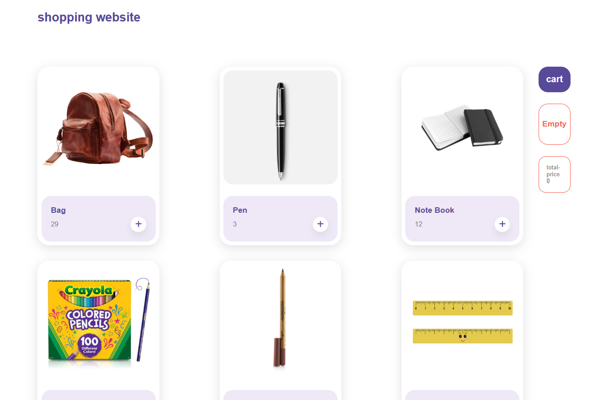
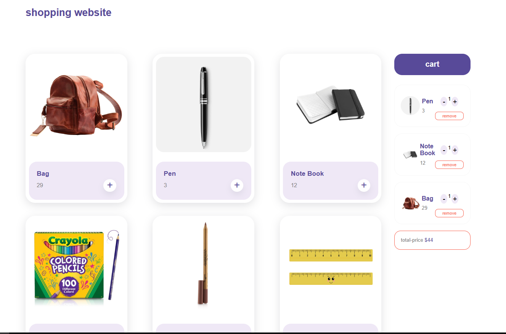

#  shopping project

در این پروژه سعی شده است تا در یک صفحه ی فروشگاهی،
 بتوان محصولات مختلف رو در سبد خرید قرار داد و تعداد انهارا مشخص کرد.  
 و همچنین در قسمت سبد خرید امکان ویرایش وجود داشته باشد.

---

## ویژگی‌ها
- ➕ اضافه کردن محصول جدید به سبد خرید
- 🗑️ حذف و یا کاهش تعداد محصول در سبد خرید
- 💾 دیدن جمع قیمت ها در سبد خرید
- 📱 طراحی ریسپانسیو (مناسب موبایل و دسکتاپ)

---

## کنولوژی‌ها
- HTML5  
- CSS3 (Flexbox, Grid, Responsive Design)  
- JavaScript (ES6+, DOM, LocalStorage)  

---

##دموی آنلاین
👉 [مشاهده پروژه در GitHub Pages](https://github.com/zahramalekpour/shoppingproject)

---

##اسکرین‌شات

